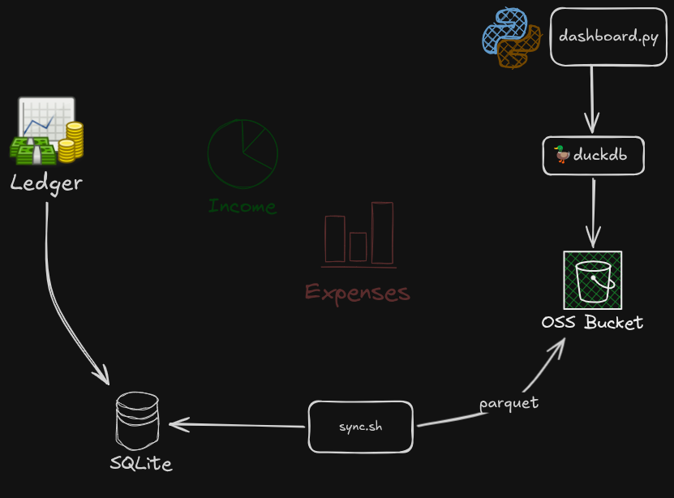

# Expense Dashboard

A Streamlit dashboard that reads personal financial data from Parquet files stored in S3-compatible object storage and visualises it in various ways. Includes ETL scripts to load financial records from a [GnuCash](https://gnucash.org/) ledger.

## Prerequisites

- [Python](#python) installed, virtualenv active, dependencies installed
- [Credentials](#credentials) generated, AWS CLI installed configured
- [Environment](#environment) configured with S3 configs & credentials from above

## Quickstart

```
streamlit run dashboard/app.py
```

The app will be available at http://localhost:8501.

## Limitations

- Only GnuCash is supported as source, tho in principle anything that can produce the same Parquet format should work
- It is assumed that for some reason you want to see all your financials in GBP
- This is mostly vibe coded by Claude Code - Try to read the code at your own peril 🫣

## Setup

### Credentials

- Generate Linode OSS credentials:

```sh
linode object-storage keys-create --label "${USER}@${HOSTNAME}-cli"
```

- Use the credentials generated above with `aws configure --profile linode`
- To use Linode OSS with the `aws` CLI, use the `--endpoint-url` parameter:

```sh
aws --profile linode --endpoint-url https://eu-central-1.linodeobjects.com s3 ls
```

- To avoid having to use `--endpoint-url` each time, update `~/.aws/config`:

```sh
[profile linode]
region = eu-central-1
endpoint_url = https://eu-central-1.linodeobjects.com
```

- A `.env` file in the project root containing S3 credentials:


### Python

```bash
# Install dependencies (first time only)
python -m venv venv
venv/bin/pip install -r requirements.txt
```

### Environment

- Create make sure these are set in your shell or create a `.env` file in your working directory
- The `S3_ENDPOINT` can be set to support object storage providers other than AWS S3
- NB: So far only S3 access keys are supported and strictly required - to be reviewed

```sh
AWS_ACCESS_KEY_ID=...
AWS_SECRET_ACCESS_KEY=...
S3_BUCKET=...
S3_REGION=eu-central
S3_ENDPOINT=eu-central-1.linodeobjects.com
```

## Data Extraction

Expense data is extracted from a GnuCash database and uploaded to S3 as Parquet. The target is an S3 bucket configured via the `S3_BUCKET` environment variable (See [Environment](#environment))




### Prerequisites

- [GnuCash](https://gnucash.org/) ledger exported in sqlite format - See [here](https://www.gnucash.org/docs/v5/C/gnucash-guide/basics-files1.html)

### Data Sync

```bash
./scripts/sync.sh <db-file> <quarter>

# Example
./scripts/sync.sh ~/Downloads/2026.sqlite.gnucash 2026-Q2
```

## Exporting Data to CSV

```sh
OUTDIR=./tmp
mkdir -o $OUTDIR
. venv/bin/activate
./scripts/fetch_rates.py --quarter 2026-Q1 --out $OUTDIR/rates-q1.json
./scripts/export.py --db ~/Downloads/2026-31-05.sqlite.gnucash --output $OUTDIR/2026-Q1.csv --rates $OUTDIR/rates-q1.json --quarter 2026-Q1
```

## Querying data directly with DuckDB

The `.duckdbrc` in the project root pre-loads the S3 secret and creates a `transactions` view over the full parquet dataset. Use the wrapper script so that credentials from `.env` are picked up automatically:

```bash
./scripts/duckdb.sh                   # interactive shell
./scripts/duckdb.sh -c "SELECT ..."   # one-shot query
```

Once in the shell, the `transactions` view is ready:

```sql
-- Spend by account type
SELECT account_type, round(sum(gbp_value), 2) AS gbp
FROM transactions
GROUP BY 1 ORDER BY 2 DESC;

-- Monthly expenses
SELECT year, month, round(sum(gbp_value), 2) AS gbp
FROM transactions
WHERE account_type = 'expenses'
GROUP BY 1, 2 ORDER BY 1, 2;
```

The view uses hive partitioning, so filtering on `year` and `month` is efficient — DuckDB prunes irrelevant files without scanning them.

## Building

```bash
docker build -t finance-reports-dashboard:latest dashboard/
```

## Deployment

- [Docker](https://docs.docker.com/get-docker/)
- [k3d](https://k3d.io/) with a running cluster
- `kubectl` configured to point at the cluster
- [Helm 3](https://helm.sh/docs/intro/install/)


### Docker

TODO

### k3d

See [docs/k3d.md](./docs/k3d.md)
  